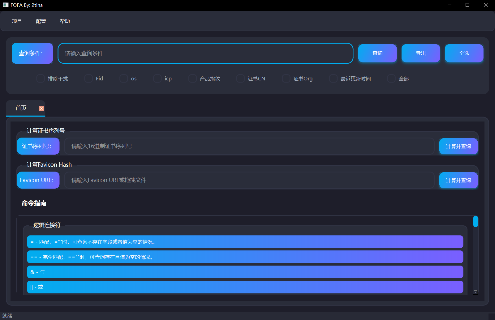

# FOFA

一个功能完整的FOFA查询工具，提供现代化的图形用户界面，支持多种查询方式和数据导出功能。

> **注意**: 本项目是基于 [FOFA Viewer (Java)](https://github.com/wgpsec/fofa_viewer) 进行二次开发的Python版本，使用PySide6实现了原JavaFX版本的所有核心功能，并在此基础上进行了优化和改进。

## 界面预览



*注：界面展示现代化的深色主题，支持圆角设计和渐变按钮效果*

## 功能特性

### 核心功能
- **FOFA查询**: 支持多种查询语法，包括基础类、标记类、协议类、网站类、地理位置、证书类等
- **证书序列号查询**: 通过证书序列号快速查询相关资产
- **Favicon Hash查询**: 通过Favicon Hash值查询相关资产
- **数据导出**: 支持导出为Excel和TXT格式
- **命令指南**: 内置完整的FOFA查询语法指南，点击即可使用

### UI特性
- **现代化深色主题**: 精美的深色主题界面，支持主题切换（深色/白色）
- **圆角设计**: 统一的圆角设计风格
- **渐变按钮**: 蓝紫渐变按钮，带悬停和点击效果
- **响应式布局**: 自适应窗口大小，流畅的用户体验
- **中文支持**: 完整的中文显示支持，无乱码问题

## 系统要求

- Python 3.8+
- Windows / Linux / macOS

## 安装步骤

### 1. 克隆或下载项目

```bash
git clone <repository-url>
cd fofa
```

### 2. 安装依赖

```bash
pip install -r requirements.txt
```

### 3. 配置FOFA API

创建 `config.properties` 文件（可选，程序会自动创建）：

```properties
# FOFA配置
api=https://fofa.info
key=your_fofa_api_key
max_size=1000
check_status=on

# 代理配置（可选）
proxy_status=off
proxy_type=HTTP
proxy_ip=
proxy_port=
proxy_user=
proxy_password=
```

### 4. 运行程序

```bash
python main.py
```

## 使用说明

### 基本查询

1. 在主界面的查询条件输入框中输入FOFA查询语句
2. 选择需要的额外字段（Fid、os、icp、产品指纹等）
3. 点击"查询"按钮执行查询
4. 结果会显示在表格中，双击表格行可在浏览器中打开URL

### 证书序列号查询

1. 切换到"首页"标签
2. 在"计算证书序列号"区域输入16进制证书序列号
3. 点击"计算并查询"按钮

### Favicon Hash查询

1. 切换到"首页"标签
2. 在"计算Favicon Hash"区域输入Favicon URL
3. 点击"计算并查询"按钮

### 命令指南

1. 在"首页"标签下方有完整的命令指南
2. 滚动查看所有FOFA查询语法
3. 点击任意命令即可自动填充到查询条件输入框

### 数据导出

1. 在查询结果页面点击"导出"按钮
2. 选择导出格式（Excel或TXT）
3. 选择保存位置
4. 导出完成后会显示保存路径

### 配置管理

1. 点击菜单栏"配置" -> "修改配置"
2. 在"FOFA配置"标签中设置API地址和密钥
3. 在"代理配置"标签中设置代理（可选）
4. 点击"OK"保存配置

## 项目结构

```
fofa/
├── main.py                 # 程序入口
├── requirements.txt         # 依赖列表
├── README.md              # 本文件
├── main/                  # 主程序模块
│   ├── app.py            # 应用程序入口
│   └── config.py         # 配置管理
├── controllers/          # 控制器模块
│   ├── main_controller.py    # 主窗口控制器
│   └── config_dialog.py      # 配置对话框
├── models/              # 数据模型
│   └── table_bean.py     # 表格数据模型
├── utils/               # 工具类
│   ├── request_util.py  # HTTP请求工具
│   ├── data_util.py     # 数据处理工具
│   ├── security.py      # 安全工具
│   ├── theme.py         # 主题管理
│   └── ui_style.py      # UI样式
└── widgets/             # 自定义组件
    ├── modern_button.py     # 现代风格按钮
    ├── styled_label.py      # 样式化标签
    ├── command_guide.py     # 命令指南组件
    ├── animated_button.py   # 动画按钮（已弃用）
    └── rounded_widget.py     # 圆角组件（已弃用）
```

## 依赖说明

- **PySide6**: Qt6的Python绑定，用于GUI界面
- **requests**: HTTP请求库
- **beautifulsoup4**: HTML解析库
- **lxml**: XML/HTML解析器
- **openpyxl**: Excel文件处理
- **mmh3**: MurmurHash3算法（用于Favicon Hash计算）
- **cryptography**: 加密库（用于证书处理）

## 安全注意事项

1. **API密钥安全**: 请妥善保管您的FOFA API密钥，不要泄露给他人
2. **配置文件**: `config.properties` 文件包含敏感信息，建议不要提交到版本控制系统
3. **网络请求**: 程序会向FOFA API发送请求，请确保网络连接正常
4. **SSL验证**: 为了兼容性，程序默认关闭SSL证书验证，在生产环境中建议启用

## 常见问题

### Q: 程序无法启动？
A: 请确保已安装所有依赖，运行 `pip install -r requirements.txt`

### Q: 查询失败，提示401错误？
A: 请检查config.properties中的API密钥是否正确

### Q: 查询结果为空？
A: 请检查查询语句是否正确，可以参考命令指南中的示例

### Q: 导出功能不可用？
A: 请确保有写入权限，并且磁盘空间充足

### Q: 中文显示乱码？
A: 程序已优化中文显示，如果仍有问题，请检查系统字体设置

## 开发说明

### 代码规范
- 使用Python类型提示
- 遵循PEP 8代码规范
- 使用文档字符串说明函数功能
- 异常处理要完整

### 安全规范
- 所有用户输入必须验证
- 文件路径必须安全检查
- URL必须格式验证
- 限制文件大小和超时时间

### 性能优化
- 使用异步线程处理网络请求
- 分批更新表格数据，避免UI冻结
- 使用流式下载大文件
- 限制内存使用

## 版本历史

### v1.0.0
- 初始版本
- 完整的FOFA查询功能
- 现代化UI设计
- 数据导出功能
- 命令指南

## 致谢与原项目

本项目是基于 [FOFA Viewer (Java)](https://github.com/wgpsec/fofa_viewer) 进行二次开发的Python版本。

- **原项目**: [wgpsec/fofa_viewer](https://github.com/wgpsec/fofa_viewer)
- **原项目作者**: WgpSec
- **原项目维护者**: f1ashine
- **许可证**: MIT License

本项目在保持原项目核心功能的基础上，使用Python和PySide6重新实现，并进行了以下改进：
- 现代化的UI设计（深色主题、圆角、渐变效果）
- 增强的安全验证和输入校验
- 优化的代码结构和性能
- 完整的命令指南功能

## 许可证

本项目基于原Java版本转换而来，遵循原项目的MIT License许可证要求。

## 二次开发

本项目基于 [FOFA Viewer (Java)](https://github.com/wgpsec/fofa_viewer) 进行二次开发，使用Python和PySide6重新实现。

### 开发环境

```bash
# 克隆项目
git clone <repository-url>
cd fofa

# 安装依赖
pip install -r requirements.txt

# 运行项目
python main.py
```

### 代码结构说明

- `main.py`: 程序入口
- `main/`: 主程序模块（配置管理、应用入口）
- `controllers/`: 控制器模块（UI逻辑处理）
- `models/`: 数据模型（数据结构定义）
- `utils/`: 工具类（请求、数据处理、安全、主题）
- `widgets/`: 自定义组件（按钮、标签、命令指南）

### 贡献指南

欢迎提交Issue和Pull Request！

- 提交Bug：请详细描述问题复现步骤
- 功能建议：请说明使用场景和预期效果
- 代码贡献：请遵循PEP 8规范，添加必要的注释和文档

## 联系方式

如有问题或建议，请通过GitHub Issues反馈。

## 相关链接

- [原项目 (Java版本)](https://github.com/wgpsec/fofa_viewer)
- [FOFA官网](https://fofa.info)
- [FOFA API文档](https://fofa.info/api)

